

# a11g-final-submission

**Team Number: 23**

**Team Name: SmartShade**

| Team Member Name   | Email Address           | GitHub Username |
| ------------------ | ----------------------- | --------------- |
| Sofia Hedlund      | shedlund@seas.upenn.edu | sofia-hedlund   |
| Amanda Garbellotto | amandatg@seas.upenn.edu | amandagarbel    |

**GitHub Repository URL: https://github.com/ese5160/a11g-final-submission-s26-s26-t23-smartshade** 

## 1. Video Presentation

[Link](https://www.youtube.com/watch?v=6NbRRvrbm60)

## 2. Project Summary

**Device Description**

SmartShade is an automated blind system designed to optimize indoor comfort by adjusting tilt angles based on real-time ambient light and temperature. Our goal is to eliminate the need for manual adjustments, ensuring a seamless environment for productivity and relaxation throughout the day. By integrating Internet connectivity, the device fetches local weather forecasts to augment its onboard sensor data, allowing it to transition between energy-saving modes and personalized user presets automatically.

**Device Functionality**

The system is built around a custom PCBA featuring integrated light and temperature sensors that monitor the surrounding environment. Data is transmitted to a Node-RED dashboard for real-time visualization and remote monitoring. Based on pre-defined light intensity thresholds, a servo motor rotates the blind adjustment rod to the optimal position. Additionally, the temperature sensor acts as a thermal logic switch, triggering specific blind positions according to the natural temperature registered as hot or okay, while all system statuses are mirrored on an LCD screen for immediate feedback.

**Challenges**

On the firmware side, we encountered several challenges while implementing the over-the-air (OTA) update functionality. Initially, the device was unable to successfully download the firmware image from Azure Blob Storage due to issues with HTTPS and TLS. Azure Blob Storage required secure HTTPS connections, which meant the firmware needed proper TLS configuration and valid CA certificates loaded on the device. We also encountered issues related to DNS resolution, HTTP client configuration, and correctly formatting the firmware download URL and file path for the .rps image.

Another challenge was debugging the OTAF process itself, since the firmware would fail after the DNS resolution stage with non-obvious error codes, making it difficult to determine whether the issue was related to networking, certificates, server configuration, or the OTA library. We tried to switch from Azure HTTPS hosting to serving the firmware file through an Apache server on our VM using HTTP,  to help debug this.

One of the primary mechanical challenges was designing a reliable coupling between the servo motor and the existing blind tilt rod. We also had to calibrate the precise timing and torque required to rotate the blinds to standard increments without overstressing the motor or the hardware assembly.

Furthermore, while testing our power architecture, we discovered inconsistencies across our PCBs. On one board, the buck converter functioned correctly while the boost converter remained disconnected from the battery. Conversely, on our other two boards, the boost converter performed as expected, but the buck converter output zero volts,  and the chip began to overheat rapidly. To resolve this and move forward with testing, we bypassed the faulty stage by connecting the motor directly to the board to be powered by the battery, while the 3.3V components were powered through jumpers soldered to the stable output points using the external lab power supplies.

**Prototype Learnings**

The "bring-up" process taught us the value of incorporating jumper wires and test points to isolate and verify specific subsystems. During testing, we encountered a discrepancy while using an Electronic Load (E-Load) to verify our servo motor (rated at 6V/1A). By testing the boost converter output points with a power supply and the motor pins with the E-Load, we noticed the current draw was significantly lower than the supplier’s specifications.

This prompted an investigation into potential current leakage through continuity tests and the application of smaller, incremental loads. After rebuilding the motor circuit on a breadboard to evaluate its true startup and steady-state current, we concluded that the actual current requirement was lower than the risky readings suggested by the E-Load. This experience reinforced the importance of independent subsystem testing and quantitative analysis before integrating all peripherals into a single system.

If we were to build the device again, we would prioritize adding more dedicated test points to monitor each power rail separately, reducing the need for manual jumper soldering. We would also focus on sourcing all components for the primary PCB to avoid the need for external development boards, specifically for the light sensor. Given the issues with the buck converter, we would try to implement more rigorous thermal dissipation techniques and double-check the footprint specifications to prevent overheating in future iterations.

**Next Steps & Takeaways**

The immediate next step for the project would be the final mechanical integration: mounting the hardware to a physical blind system and coupling the motor to the tilt rod. Once assembled, we can conduct calibration tests to measure the exact time required for a full transition from 0% to 100% tilt. This data will allow us to map sensor readings to motor timing more accurately, ensuring precise blind positioning.

Looking ahead, we also planned on possibly implementing an Active Privacy Mode using a motion sensor. This feature would serve as a high-priority interrupt, automatically closing the blinds if indoor motion is detected during nighttime hours, overriding the standard light-based logic to prioritize user privacy, for example.

Through the progression of the course, we learned how to develop the intuition to bridge high-level firmware with physical hardware, from writing the understanding of our correct microcontroller, to designing a customized PCB with all the required components for a fully functioning prototype. We also discovered how to use diagnostic tools and isolation techniques to troubleshoot PCB power issues and sensor discrepancies effectively. Throughout the course, it was nice to get some hands-on experience in professional software like Altium and Node-RED, which yielded a steep learning curve, but allowed us to gain great practice while debugging our specific system.

## 3. Hardware & Software Requirements

| ID     | Description                                                                                                                                                      | Results                                                                                                                                                             |
| ------ | ---------------------------------------------------------------------------------------------------------------------------------------------------------------- | ------------------------------------------------------------------------------------------------------------------------------------------------------------------- |
| HRS-01 | The device shall be powered by a single-cell Li-ion battery.                                                                                                     | Partially met.The motor was power by the LiPo while our buck converter presented problems and our 3V3 power rail had to be externally powered.                      |
| HRS-02 | The device shall use the SIWG917Y12MGABA module for connection to Wi-Fi and system control.                                                                      | Met.                                                                                                                                                                |
| HRS-03 | The device shall use at least one I2C sensor for measuring ambient light from the window.                                                                        | Met.                                                                                                                                                                |
| HRS-04 | The actuator shall be able to produce at least X N .m of torque to be able to rotate the blinds rod.                                                             | Met (precise calculations were not made from the physical prototype itself but the communication between the sensors and motor activation was reached as intended.) |
| HRS-05 | The actuator shall be able to rotate the blinds rod enough to fully open and close the blinds (range 0% to 100% tilt after calibration).                         | Met.                                                                                                                                                                |
| HRS-06 | The actuator shall be able to rotate the blinds rod partially to only allow some light through the blinds.                                                       | Met.                                                                                                                                                                |
| HRS-07 | The system shall include an LCD to display device status directly.                                                                                               | Met.                                                                                                                                                                |
| HRS-08 | The LCD should display  the blinds tilt %, temperature, and weather condition.                                                                                   | Met.                                                                                                                                                                |
| HRS-09 | The device should estimate the blinds tilt position with an accuracy of  ±10% and display this value on the LCD using an encoder/angle sensor.                  | Partially met, value is displayed on LCD.                                                                                                                           |
| HRS-10 | The device shall support a calibration process to establish reference points for blind tilt so that the system can map the actuator to a 0-100% tilt percentage. | Not included.                                                                                                                                                       |
| HRS-11 | The device should include an occupancy sensor to enable privacy/ comfort behavior based on presence.                                                             | Not included.                                                                                                                                                       |
| HRS-12 | The system shall include a 3.3V - 5V regulator rail to power the MCU and all sensors.                                                                            | Met.                                                                                                                                                                |
| HRS-13 | The device shall include a boost converter up to 6V to power the motor subsystem.                                                                                | Met.                                                                                                                                                                |
| HRS-14 | The enclosure should mechanically clamp to the blinds rod and generate precise rotation with minimal slip.                                                       | Not met.                                                                                                                                                            |

| ID     | Description                                                                                                                                                                                                  | ``                                                                        |
| ------ | ------------------------------------------------------------------------------------------------------------------------------------------------------------------------------------------------------------ | ------------------------------------------------------------------------- |
| SRS-01 | In default mode, the system shall use information from the light and thermal sensors, as well as schedule times for sunrise and sunset to control the blinds.                                                | Met.                                                                      |
| SRS-02 | The light sensor shall report values at a frequency of 2Hz.                                                                                                                                                  | Not met, our light sensor currently reports at a frequency of 0.5 Hz.     |
| SRS-03 | The system shall compute a target tilt of % no more frequently than once every 60s, and shall enforce a minimum interval of 60-180s between movements to avoid oscillation.                                  | Not included.                                                             |
| SRS-04 | The device shall connect to a Wi-Fi network and communicate with Node-RED using MQTT or HTTP.                                                                                                                | Met.                                                                      |
| SRS-05 | The system shall detect manual override by identifying a change in the measured position when no motor command is active and shall update the internal position state and LCD monitoring screen accordingly. | Met.                                                                      |
| SRS-06 | The device shall retrieve weather data (cloud cover, sunset/sunrise times, temperature) at least once every 60 minutes.                                                                                      | Not included.                                                             |
| SRS-07 | The device shall automatically turn the blinds to 0% tilt after sunrise and 100% tilt after sunset in default mode.                                                                                          | Partially met, device turns to 100% tilt if temperature switch activates. |
| SRS-08 | After receiving a new target tilt %, the device shall move the actuator to the target within 3 seconds of delay.                                                                                             | Met.                                                                      |
| SRS-09 | The device shall prevent the actuator from driving past the calibrated mechanical limits (0%-100%) with end-stops.                                                                                           | N/A, used continuous motion servo.                                        |
| SRS-10 | The system shall represent blind position as a continuous value and shall persist the last known position in non-volatile memory.                                                                            | Met.                                                                      |
| SRS-11 | The system shall detect a stall condition in the motor if its position does not change after 2 seconds of sending a command and shall alert a fault throughout the LCD screen.                               | Not met.                                                                  |
| SRS-12 | On startup, the device shall run a calibration routine to establish the mapping between the actuator angle and the blinds tilt %.                                                                            | Not included.                                                             |

## 4. Project Photos & Screenshots

The standalone PCBA, top:

 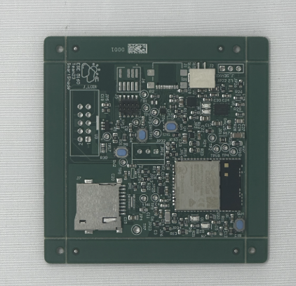

The standard PCBA, bottom: 

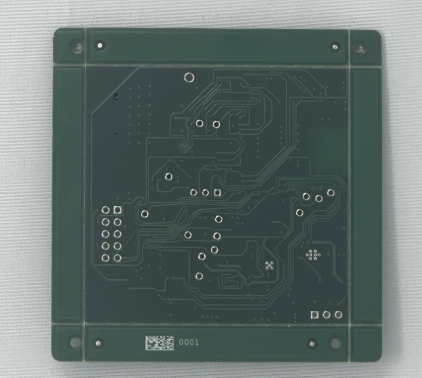

Thermal camera images while the board is running under load (you may use your Board Bringup Thermal image here!):

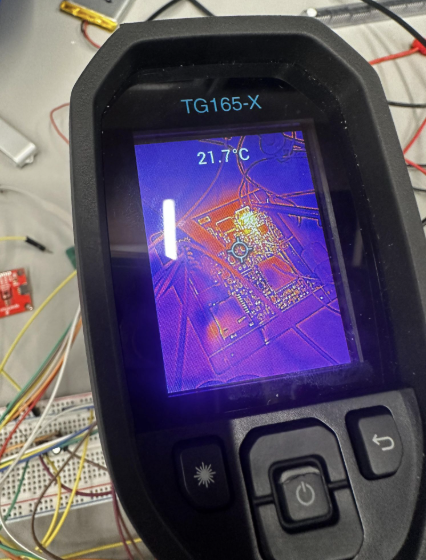 

The Altium board design in 2D top view: 

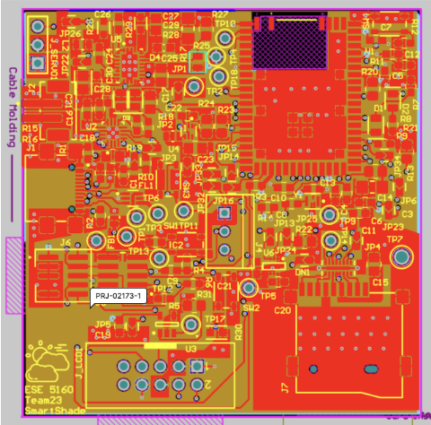

The Altium board design in 2D bottom view:

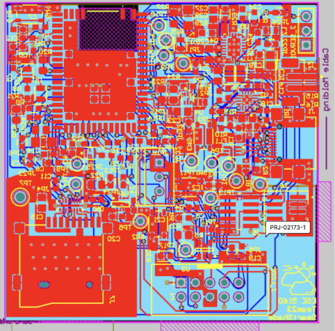

The Altium Board design in 3D top vievw:

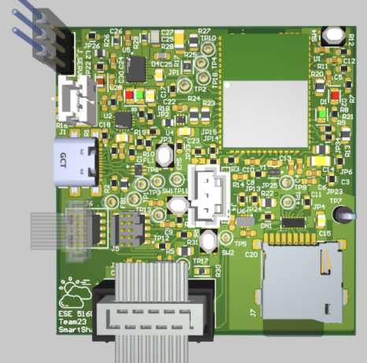 

The Altium Board design in 3D bottom view:

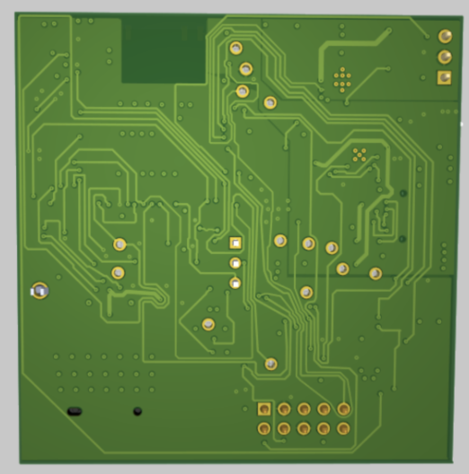

Node-RED dashboard:

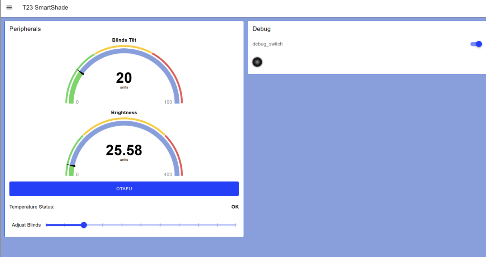

Node-RED backend: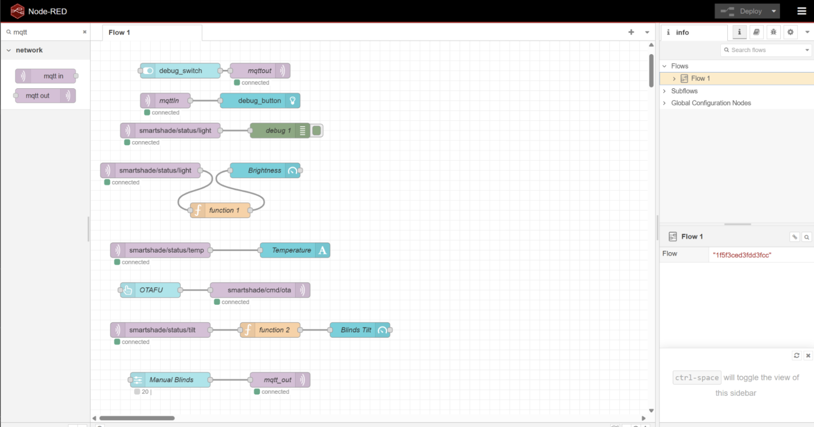Hardware pictures:

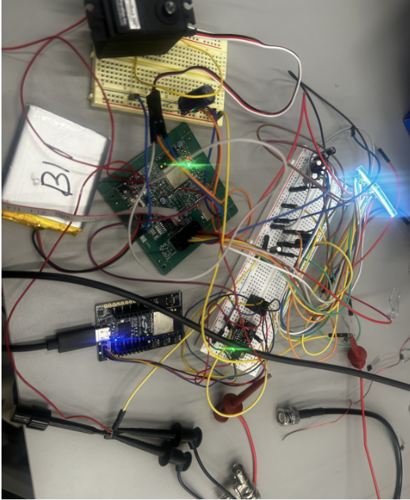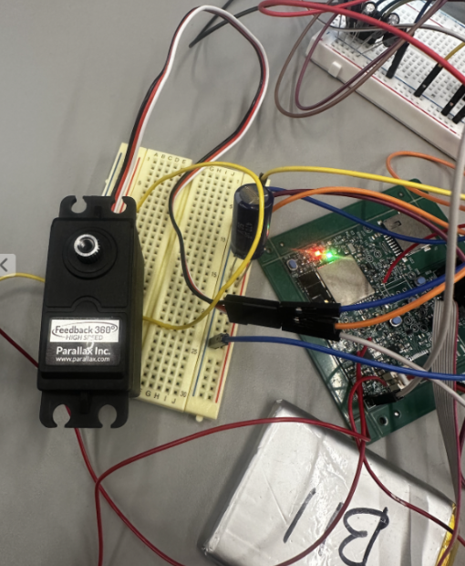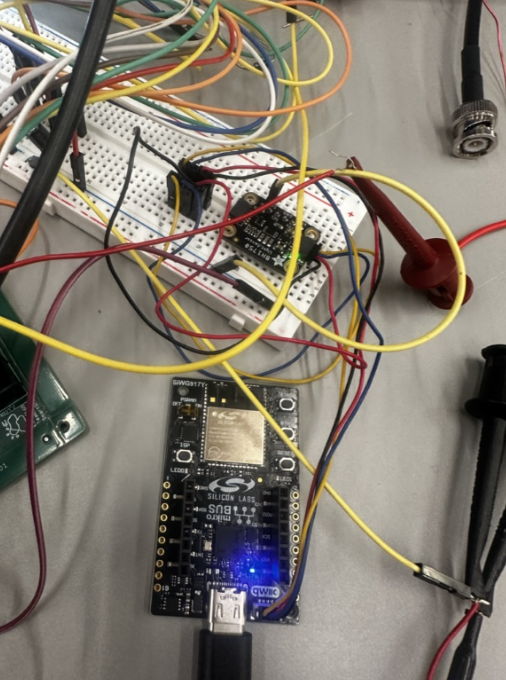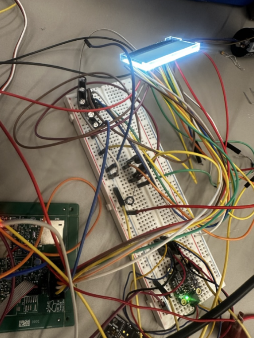

System Diagram:

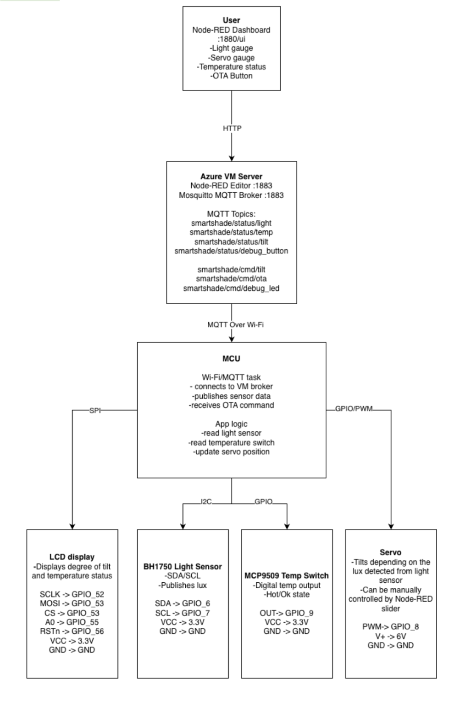

## 5. Codebase

Do *not* commit any of your source code to this repository. Rather, provide links to the other GitHub repository you've already been using with your firmware.

- Final embedded C firmware:

  [https://github.com/ese5160/final-project-firmware-s26-t23-smartshade ](https://github.com/ese5160/final-project-firmware-s26-t23-smartshade)
- Node Red dashboard

    Editor link:[http://20.64.208.7:1880/#flow/1f5f3ced3fdd3fcc](http://20.64.208.7:1880/#flow/1f5f3ced3fdd3fcc)

    Dashboard link:[http://20.64.208.7:1880/dashboard/page1](http://20.64.208.7:1880/dashboard/page1)
